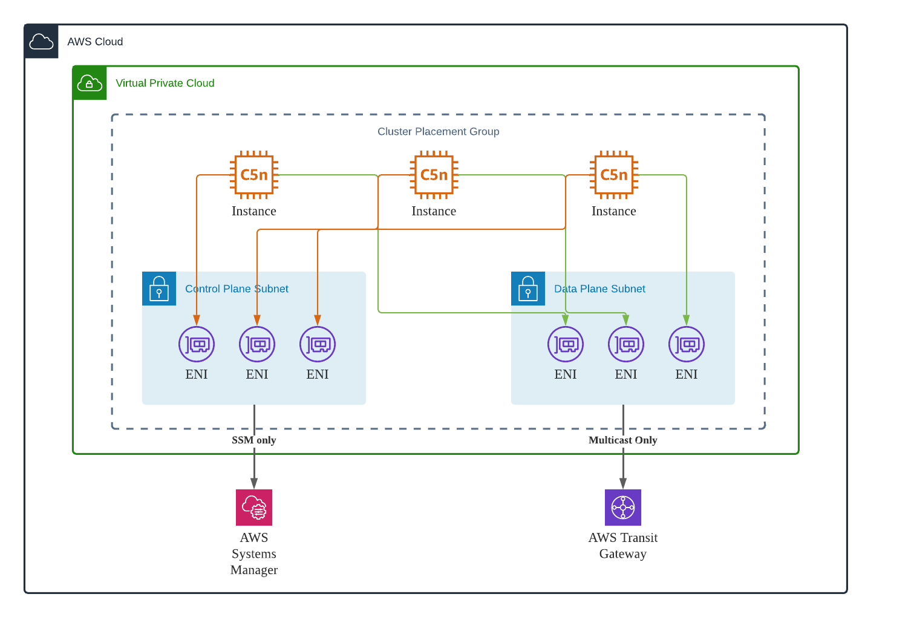

# Aeron UDP Multicast Latency Benchmark in AWS Cloud
Identify the node to node latency between nodes in Cluster Placement Group.

## Architecture


## Getting started
```
yarn install
yarn build
cdk bootstrap
cdk deploy
```

## Run iperf multicast benchmark
### Listen multicast traffic from server side
```
iperf -s -u -B 225.0.1.1 -i 1
```

### Initiate multicast traffic from client side 
```
iperf -c 225.0.1.1 -u -T 32 -i 1
```

```
[Server] iperf -s -u -e -B 239.255.0.1 -i 1
[Client] iperf -c 239.255.0.1 -u -l 20 -b 100M -e -i 1 -T 32
```

## Increase kernel socket buffer
```
sudo sysctl -w net.core.rmem_default=2097152
sudo sysctl -w net.core.rmem_max=2097152
sudo sysctl -w net.core.wmem_default=2097152
sudo sysctl -w net.core.wmem_max=2097152
```

## Run Aeron multicast ping pong benchmark
### Run MediaDriver at the background
```
java -javaagent:/opt/codeguru/codeguru-profiler-java-agent-standalone-1.2.1.jar="profilingGroupName:AeronPingPong-c5d-metal,heapSummaryEnabled:true" \
    -cp aeron-all/build/libs/aeron-all-1.37.0.jar \
    -XX:+UnlockDiagnosticVMOptions \
    -XX:GuaranteedSafepointInterval=300000 \
    -XX:+UseBiasedLocking \
    -XX:BiasedLockingStartupDelay=0 \
    -XX:+UseParallelOldGC \
    -Djava.net.preferIPv4Stack=true \
    -Dagrona.disable.bounds.checks=true \
    io.aeron.samples.LowLatencyMediaDriver &
```

No CodeGuru
```
java -cp aeron-all/build/libs/aeron-all-1.37.0.jar \
    -XX:+UnlockDiagnosticVMOptions \
    -XX:GuaranteedSafepointInterval=300000 \
    -XX:+UseBiasedLocking \
    -XX:BiasedLockingStartupDelay=0 \
    -XX:+UseParallelOldGC \
    -Djava.net.preferIPv4Stack=true \
    -Dagrona.disable.bounds.checks=false \
    io.aeron.samples.LowLatencyMediaDriver &
```

C MediaDriver
```
export AGRONA_DISABLE_BOUNDS_CHECKS=true
./cppbuild/Release/binaries/aeronmd -Daeron_print_configuration=true \
  -Dterm_buffer_sparse_file=false \
  -D&
```

### UDP Multicast Ping Pong
```
java -cp aeron-all/build/libs/aeron-all-1.37.0.jar \
    -XX:+UnlockDiagnosticVMOptions \
    -XX:GuaranteedSafepointInterval=300000 \
    -XX:+UseParallelOldGC \
    -Daeron.pre.touch.mapped.memory=true \
    -Dagrona.disable.bounds.checks=true \
    -Daeron.socket.multicast.ttl=32 \
    -Daeron.sample.ping.channel="aeron:udp?endpoint=239.255.0.1:20123" \
    -Daeron.sample.pong.channel="aeron:udp?endpoint=239.255.0.3:20124" \
    io.aeron.samples.Pong
```

```
java -cp aeron-all/build/libs/aeron-all-1.37.0.jar \
    -XX:+UnlockDiagnosticVMOptions \
    -XX:GuaranteedSafepointInterval=300000 \
    -XX:+UseParallelOldGC \
    -Daeron.sample.messages=1000000 \
    -Daeron.sample.messageLength=32 \
    -Daeron.pre.touch.mapped.memory=true \
    -Dagrona.disable.bounds.checks=true \
    -Daeron.socket.multicast.ttl=32 \
    -Daeron.sample.ping.channel="aeron:udp?endpoint=239.255.0.1:20123" \
    -Daeron.sample.pong.channel="aeron:udp?endpoint=239.255.0.3:20124" \
    io.aeron.samples.Ping
```

Sample result shown in the `Ping` App
```
[ssm-user@ip-10-0-117-146 aeron]java -cp aeron-all/build/libs/aeron-all-1.37.0.jar \
>     -XX:+UnlockDiagnosticVMOptions \
>     -XX:GuaranteedSafepointInterval=300000 \
>     -XX:+UseParallelOldGC \
>     -Daeron.sample.messages=100000 \
>     -Daeron.sample.messageLength=32 \
>     -Daeron.pre.touch.mapped.memory=true \
>     -Dagrona.disable.bounds.checks=true \
>     -Daeron.socket.multicast.ttl=32 \
>     -Daeron.sample.ping.channel="aeron:udp?endpoint=239.255.0.1:20123" \
>     -Daeron.sample.pong.channel="aeron:udp?endpoint=239.255.0.3:20124" \
>     io.aeron.samples.Ping
Publishing Ping at aeron:udp?endpoint=239.255.0.1:20123 on stream id 1002
Subscribing Pong at aeron:udp?endpoint=239.255.0.3:20124 on stream id 1003
Message length of 32 bytes
Using exclusive publications false
Waiting for new image from Pong...
Available image: channel=aeron:udp?endpoint=239.255.0.3:20124 streamId=1003 session=-1404148076
Warming up... 10 iterations of 10000 messages
Available image: channel=aeron:udp?endpoint=239.255.0.3:20124 streamId=1003 session=-443981498
Pinging 100000 messages
Histogram of RTT latencies in microseconds.
       Value     Percentile TotalCount 1/(1-Percentile)

     187.135 0.000000000000          2           1.00
     193.407 0.100000000000      10210           1.11
     194.943 0.200000000000      20355           1.25
     196.095 0.300000000000      30434           1.43
     197.503 0.400000000000      40845           1.67
     198.655 0.500000000000      50020           2.00
     199.551 0.550000000000      55659           2.22
     200.319 0.600000000000      60053           2.50
     201.343 0.650000000000      65147           2.86
     202.751 0.700000000000      70950           3.33
     203.903 0.750000000000      75293           4.00
     204.671 0.775000000000      77579           4.44
     205.695 0.800000000000      80086           5.00
     206.975 0.825000000000      82565           5.71
     208.255 0.850000000000      85031           6.67
     210.303 0.875000000000      87511           8.00
     211.455 0.887500000000      88906           8.89
     212.735 0.900000000000      90015          10.00
     214.399 0.912500000000      91255          11.43
     216.575 0.925000000000      92513          13.33
     219.263 0.937500000000      93771          16.00
     221.055 0.943750000000      94403          17.78
     223.231 0.950000000000      95000          20.00
     226.047 0.956250000000      95646          22.86
     229.247 0.962500000000      96258          26.67
     233.087 0.968750000000      96876          32.00
     235.903 0.971875000000      97210          35.56
     238.847 0.975000000000      97503          40.00
     242.431 0.978125000000      97820          45.71
     246.911 0.981250000000      98135          53.33
     252.287 0.984375000000      98438          64.00
     255.615 0.985937500000      98594          71.11
     259.071 0.987500000000      98757          80.00
     263.679 0.989062500000      98915          91.43
     268.799 0.990625000000      99077         106.67
     274.175 0.992187500000      99223         128.00
     276.735 0.992968750000      99297         142.22
     280.063 0.993750000000      99376         160.00
     283.391 0.994531250000      99458         182.86
     286.975 0.995312500000      99541         213.33
     291.071 0.996093750000      99614         256.00
     294.143 0.996484375000      99650         284.44
     296.703 0.996875000000      99688         320.00
     299.263 0.997265625000      99727         365.71
     303.359 0.997656250000      99768         426.67
     307.711 0.998046875000      99809         512.00
     310.015 0.998242187500      99826         568.89
     313.855 0.998437500000      99847         640.00
     317.695 0.998632812500      99864         731.43
     322.303 0.998828125000      99883         853.33
     334.335 0.999023437500      99903        1024.00
     338.431 0.999121093750      99913        1137.78
     342.527 0.999218750000      99922        1280.00
     357.887 0.999316406250      99932        1462.86
     366.591 0.999414062500      99942        1706.67
     384.511 0.999511718750      99952        2048.00
     392.959 0.999560546875      99957        2275.56
     407.295 0.999609375000      99961        2560.00
     411.647 0.999658203125      99966        2925.71
     430.847 0.999707031250      99971        3413.33
     455.935 0.999755859375      99976        4096.00
     472.319 0.999780273438      99979        4551.11
     477.439 0.999804687500      99981        5120.00
     487.935 0.999829101563      99983        5851.43
     528.895 0.999853515625      99986        6826.67
     539.135 0.999877929688      99988        8192.00
     577.535 0.999890136719      99990        9102.22
     604.159 0.999902343750      99991       10240.00
     606.207 0.999914550781      99992       11702.86
     626.175 0.999926757813      99993       13653.33
     652.799 0.999938964844      99994       16384.00
     670.719 0.999945068359      99995       18204.44
     688.127 0.999951171875      99996       20480.00
     688.127 0.999957275391      99996       23405.71
     750.591 0.999963378906      99997       27306.67
     750.591 0.999969482422      99997       32768.00
     770.559 0.999972534180      99998       36408.89
     770.559 0.999975585938      99998       40960.00
     770.559 0.999978637695      99998       46811.43
     836.607 0.999981689453      99999       54613.33
     836.607 0.999984741211      99999       65536.00
     836.607 0.999986267090      99999       72817.78
     836.607 0.999987792969      99999       81920.00
     836.607 0.999989318848      99999       93622.86
     871.935 0.999990844727     100000      109226.67
     871.935 1.000000000000     100000
#[Mean    =      202.367, StdDeviation   =       14.992]
#[Max     =      871.935, Total count    =       100000]
#[Buckets =           24, SubBuckets     =         2048]

Execute again? (y/n):
```

### UDP Unicast Ping Pong
Run `Pong` App on the first instance
```
java --add-opens java.base/sun.nio.ch=ALL-UNNAMED --add-opens jdk.unsupported/sun.misc=ALL-UNNAMED \
    -cp aeron-all/build/libs/aeron-all-1.37.0.jar \
    -XX:+UnlockDiagnosticVMOptions \
    -XX:GuaranteedSafepointInterval=300000 \
    -XX:+UseParallelOldGC \
    -Daeron.pre.touch.mapped.memory=true \
    -Dagrona.disable.bounds.checks=true \
    -Daeron.socket.multicast.ttl=32 \
    -Daeron.sample.ping.channel="aeron:udp?endpoint=10.0.6.34:20123" \
    -Daeron.sample.pong.channel="aeron:udp?endpoint=10.0.6.11:20124" \
    io.aeron.samples.Pong
```

```
java -cp aeron-all/build/libs/aeron-all-1.37.0.jar \
    -XX:+UnlockDiagnosticVMOptions \
    -XX:GuaranteedSafepointInterval=300000 \
    -XX:+UseParallelOldGC \
    -Daeron.pre.touch.mapped.memory=true \
    -Dagrona.disable.bounds.checks=true \
    -Daeron.socket.multicast.ttl=32 \
    -Daeron.sample.ping.channel="aeron:udp?endpoint=10.0.6.126:20123" \
    -Daeron.sample.pong.channel="aeron:udp?endpoint=10.0.6.177:20124" \
    io.aeron.samples.Pong
```

```
java -javaagent:/home/ssm-user/jHiccup-2.0.10/jHiccup.jar \
    -cp aeron-all/build/libs/aeron-all-1.37.0.jar \
    -XX:+UnlockDiagnosticVMOptions \
    -XX:GuaranteedSafepointInterval=300000 \
    -XX:+UseParallelOldGC \
    -Daeron.pre.touch.mapped.memory=true \
    -Dagrona.disable.bounds.checks=true \
    -Daeron.socket.multicast.ttl=32 \
    -Daeron.sample.ping.channel="aeron:udp?endpoint=10.0.6.34:20123" \
    -Daeron.sample.pong.channel="aeron:udp?endpoint=10.0.6.11:20124" \
    io.aeron.samples.Pong
```

export AERON_PRE_TOUCH_MAPPED_MEMORY=true
export AERON_SAMPLE_PING_CHANNEL="aeron:udp?endpoint=10.0.6.150:20123"
export AERON_SAMPLE_PONG_CHANNEL="aeron:udp?endpoint=10.0.6.177:20124"
./cppbuild/Release/binaries/Pong

Run `Ping` App on the second instance
```
java -cp aeron-all/build/libs/aeron-all-1.37.0.jar \
    -XX:+UnlockDiagnosticVMOptions \
    -XX:GuaranteedSafepointInterval=300000 \
    -XX:+UseParallelOldGC \
    -Daeron.sample.messages=100000 \
    -Daeron.sample.messageLength=32 \
    -Daeron.pre.touch.mapped.memory=true \
    -Dagrona.disable.bounds.checks=true \
    -Daeron.socket.multicast.ttl=32 \
    -Daeron.sample.ping.channel="aeron:udp?endpoint=10.0.6.126:20123" \
    -Daeron.sample.pong.channel="aeron:udp?endpoint=10.0.6.177:20124" \
    io.aeron.samples.Ping
```

```
java --add-opens java.base/sun.nio.ch=ALL-UNNAMED --add-opens jdk.unsupported/sun.misc=ALL-UNNAMED \
  -cp aeron-all/build/libs/aeron-all-1.37.0.jar \
  -XX:+UnlockDiagnosticVMOptions \
  -XX:GuaranteedSafepointInterval=300000 \
  -XX:+UseParallelOldGC \
  -Daeron.sample.messages=100000 \
  -Daeron.sample.messageLength=32 \
  -Daeron.pre.touch.mapped.memory=true \
  -Dagrona.disable.bounds.checks=true \
  -Daeron.socket.multicast.ttl=32 \
  -Daeron.sample.ping.channel="aeron:udp?endpoint=10.0.6.34:20123" \
  -Daeron.sample.pong.channel="aeron:udp?endpoint=10.0.6.11:20124" \
  io.aeron.samples.Ping
```

```
java -javaagent:/home/ssm-user/jHiccup-2.0.10/jHiccup.jar \
    -cp aeron-all/build/libs/aeron-all-1.37.0.jar \
    -XX:+UnlockDiagnosticVMOptions \
    -XX:GuaranteedSafepointInterval=300000 \
    -XX:+UseParallelOldGC \
    -Daeron.sample.messages=100000 \
    -Daeron.sample.messageLength=32 \
    -Daeron.pre.touch.mapped.memory=true \
    -Dagrona.disable.bounds.checks=true \
    -Daeron.socket.multicast.ttl=32 \
    -Daeron.sample.ping.channel="aeron:udp?endpoint=10.0.6.34:20123" \
    -Daeron.sample.pong.channel="aeron:udp?endpoint=10.0.6.11:20124" \
    io.aeron.samples.Ping
```

Sample result shown in the `Ping` App
```
Publishing Ping at aeron:udp?endpoint=10.0.105.248:20123 on stream id 1002
Subscribing Pong at aeron:udp?endpoint=10.0.117.146:20124 on stream id 1003
Message length of 32 bytes
Using exclusive publications false
Waiting for new image from Pong...
Available image: channel=aeron:udp?endpoint=10.0.117.146:20124 streamId=1003 session=-1404148078
Warming up... 10 iterations of 10000 messages
Pinging 100000 messages
Histogram of RTT latencies in microseconds.
       Value     Percentile TotalCount 1/(1-Percentile)

      69.183 0.000000000000          1           1.00
      71.679 0.100000000000      10161           1.11
      72.063 0.200000000000      20862           1.25
      72.511 0.300000000000      31028           1.43
      72.767 0.400000000000      41001           1.67
      73.087 0.500000000000      51227           2.00
      73.279 0.550000000000      55354           2.22
      73.471 0.600000000000      60642           2.50
      73.663 0.650000000000      66193           2.86
      73.855 0.700000000000      71185           3.33
      74.111 0.750000000000      75314           4.00
      74.303 0.775000000000      78314           4.44
      74.431 0.800000000000      80441           5.00
      74.623 0.825000000000      83387           5.71
      74.751 0.850000000000      85004           6.67
      75.135 0.875000000000      87985           8.00
      75.263 0.887500000000      89094           8.89
      75.391 0.900000000000      90153          10.00
      75.583 0.912500000000      91589          11.43
      75.839 0.925000000000      92591          13.33
      76.159 0.937500000000      93834          16.00
      76.287 0.943750000000      94417          17.78
      76.479 0.950000000000      95136          20.00
      76.799 0.956250000000      95684          22.86
      77.119 0.962500000000      96412          26.67
      77.375 0.968750000000      96878          32.00
      77.823 0.971875000000      97260          35.56
      77.951 0.975000000000      97504          40.00
      78.207 0.978125000000      97826          45.71
      78.719 0.981250000000      98139          53.33
      79.103 0.984375000000      98443          64.00
      79.551 0.985937500000      98608          71.11
      79.871 0.987500000000      98762          80.00
      80.447 0.989062500000      98924          91.43
      81.087 0.990625000000      99063         106.67
      81.791 0.992187500000      99224         128.00
      82.367 0.992968750000      99297         142.22
      83.007 0.993750000000      99380         160.00
      83.775 0.994531250000      99455         182.86
      84.671 0.995312500000      99535         213.33
      85.759 0.996093750000      99617         256.00
      86.335 0.996484375000      99650         284.44
      86.911 0.996875000000      99688         320.00
      87.615 0.997265625000      99729         365.71
      88.383 0.997656250000      99769         426.67
      89.471 0.998046875000      99806         512.00
      90.239 0.998242187500      99826         568.89
      90.815 0.998437500000      99845         640.00
      91.583 0.998632812500      99864         731.43
      92.607 0.998828125000      99883         853.33
      93.567 0.999023437500      99907        1024.00
      93.695 0.999121093750      99913        1137.78
      94.399 0.999218750000      99922        1280.00
      95.935 0.999316406250      99932        1462.86
      96.831 0.999414062500      99942        1706.67
      97.471 0.999511718750      99952        2048.00
      97.983 0.999560546875      99957        2275.56
      99.583 0.999609375000      99962        2560.00
     100.223 0.999658203125      99966        2925.71
     101.823 0.999707031250      99971        3413.33
     103.103 0.999755859375      99976        4096.00
     103.871 0.999780273438      99979        4551.11
     105.215 0.999804687500      99981        5120.00
     105.407 0.999829101563      99983        5851.43
     106.687 0.999853515625      99986        6826.67
     108.351 0.999877929688      99988        8192.00
     109.119 0.999890136719      99990        9102.22
     111.679 0.999902343750      99991       10240.00
     112.063 0.999914550781      99992       11702.86
     114.175 0.999926757813      99993       13653.33
     115.903 0.999938964844      99994       16384.00
     116.415 0.999945068359      99995       18204.44
     117.887 0.999951171875      99996       20480.00
     117.887 0.999957275391      99996       23405.71
     118.527 0.999963378906      99997       27306.67
     118.527 0.999969482422      99997       32768.00
     128.447 0.999972534180      99998       36408.89
     128.447 0.999975585938      99998       40960.00
     128.447 0.999978637695      99998       46811.43
     130.559 0.999981689453      99999       54613.33
     130.559 0.999984741211      99999       65536.00
     130.559 0.999986267090      99999       72817.78
     130.559 0.999987792969      99999       81920.00
     130.559 0.999989318848      99999       93622.86
     133.759 0.999990844727     100000      109226.67
     133.759 1.000000000000     100000
#[Mean    =       73.420, StdDeviation   =        2.097]
#[Max     =      133.759, Total count    =       100000]
#[Buckets =           24, SubBuckets     =         2048]

Execute again? (y/n):
```

## Accessing the instances
Method 1:
Prerequisite: Install the Session Manager plugin for the AWS CLI
```
aws ssm start-session --target $(aws cloudformation describe-stacks \
  --stack-name aeron-multicast-stack-dev \
  --query "Stacks[0].Outputs" --output json | \
  jq -rc '.[] | select(.OutputKey=="ClusterInstanceIds") | .OutputValue ' | \
  cut -d, -f1)
```

Method 2:
Login to AWS Console, EC2, choose the instance and click `Connect`

## Useful scripts
Get all CloudFormation Output
```
aws cloudformation describe-stacks \
  --stack-name aeron-multicast-stack-dev \
  --query "Stacks[0].Outputs" --output json
```

Get all instance ids
```
aws cloudformation describe-stacks \
  --stack-name aeron-multicast-stack-dev \
  --query "Stacks[0].Outputs" --output json | \
  jq -rc '.[] | select(.OutputKey=="ClusterInstanceIds") | .OutputValue '
```

Get a specific instance id
```
aws cloudformation describe-stacks \
  --stack-name aeron-multicast-stack-dev \
  --query "Stacks[0].Outputs" --output json | \
  jq -rc '.[] | select(.OutputKey=="ClusterInstanceIds") | .OutputValue ' | \
  cut -d, -f1
```

# Caveats
* enforce specific eth interface for multicast traffic
`route add -net 224.0.0.0 netmask 240.0.0.0 dev eth1`

* enforce igmp v2 on linux
`echo "net.ipv4.conf.eth1.force_igmp_version = 2" >> /etc/sysctl.conf`

# Reference

* https://www.powerupcloud.com/multicast-in-aws-using-aws-transit-gateway/

* using Athena to analyze VPC Flowlogs
```
CREATE EXTERNAL TABLE IF NOT EXISTS `vpc_flow_logs` (
  `version` int, 
  `account_id` string, 
  `interface_id` string, 
  `srcaddr` string, 
  `dstaddr` string, 
  `srcport` int, 
  `dstport` int, 
  `protocol` bigint, 
  `packets` bigint, 
  `bytes` bigint, 
  `start` bigint, 
  `end` bigint, 
  `action` string, 
  `log_status` string, 
  `vpc_id` string, 
  `subnet_id` string, 
  `instance_id` string, 
  `tcp_flags` int, 
  `type` string, 
  `pkt_srcaddr` string, 
  `pkt_dstaddr` string, 
  `region` string, 
  `az_id` string, 
  `sublocation_type` string, 
  `sublocation_id` string, 
  `pkt_src_aws_service` string, 
  `pkt_dst_aws_service` string, 
  `flow_direction` string, 
  `traffic_path` int 
)
PARTITIONED BY (`date` date)
ROW FORMAT DELIMITED
FIELDS TERMINATED BY ' '
LOCATION 's3://aeron-multicast-stack-de-vpcflowlogs3bucket454c2c-t8pa4ira3zof/AWSLogs/900836705824/vpcflowlogs/ap-northeast-1/'
TBLPROPERTIES ("skip.header.line.count"="1");
```

```
ALTER TABLE vpc_flow_logs
ADD PARTITION (`date`='yyyy-MM-dd')
LOCATION 's3://aeron-multicast-stack-de-vpcflowlogs3bucket454c2c-t8pa4ira3zof/AWSLogs/900836705824/vpcflowlogs/ap-northeast-1/2021/12/13';
```

Create Athena VPC FlowLogs Integration through CloudFormation, reference: https://docs.aws.amazon.com/vpc/latest/userguide/flow-logs-athena.html#flow-logs-generate-template-cli
```
aws ec2 get-flow-logs-integration-template --cli-input-json file://flow-log-config.json
```

Sample config.json
```json
{
    "FlowLogId": "fl-12345678901234567",
    "ConfigDeliveryS3DestinationArn": "arn:aws:s3:::my-flow-logs-athena-integration/templates/",
    "IntegrateServices": {
        "AthenaIntegrations": [
            {
                "IntegrationResultS3DestinationArn": "arn:aws:s3:::my-flow-logs-analysis/athena-query-results/",
                "PartitionLoadFrequency": "monthly",
                "PartitionStartDate": "2021-01-01T00:00:00",
                "PartitionEndDate": "2021-12-31T00:00:00"
            }
        ]
    }
}
```

```
aws cloudformation create-stack --stack-name my-vpc-flow-logs --template-body file://my-cloudformation-template.json
```

```
aws ec2 get-flow-logs-integration-template --flow-log-id $(aws ec2 describe-flow-logs | jq ".FlowLogs[].FlowLogId") \
  --config-delivery-s3-destination-arn $(aws ec2 describe-flow-logs | jq -r ".FlowLogs[].LogDestination")/cf-templates \
  --integrate-services AthenaIntegrations=[{IntegrationResultS3DestinationArn=\"$(aws ec2 describe-flow-logs | jq -r ".FlowLogs[].LogDestination")/athena-query-results/\",PartitionLoadFrequency=\"daily\",PartitionStartDate=\"2021-12-19T00:00:00\",PartitionEndDate=\"2022-12-19T00:00:00\"}]
```

Query for troubleshooting security group issues
```
SELECT interface_id, srcaddr, dstaddr, srcport, dstport, protocol, packets, bytes, from_unixtime("start") as "start_time", from_unixtime("end") as "end_time", action, log_status FROM "default"."vpc_flow_logs" where (protocol = 2 or protocol = 17) order by start desc;
```
